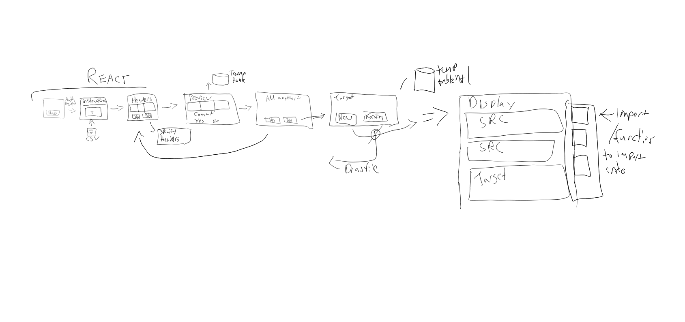

Project2
======
##h2 Contributors: Federico Peredes and Ian Rirchard

Proposal
------
We *propose* to build a Datbase Migration tool to remediate some of the hassles of migrating.  The application will allow a user to import data from one or more  database tables, which it will store in temporary table.  The user can then import or create  a target database that will be displayed along side source tables, and allow user to execute 1 or more scripting commands to alter the data prior to inserting it into the target database, preview and commit a final table.

------
We are planning to build the page(s) with React as our new technology.
Use Passport for authentication.
Use Node and Express for the Server and Routing
Sequilize for all database commands.
Heroku Deployment, with JawsDB
------
Stretch ideas:

+Incorporate Charts
+Electron to make a desktop app 

Checklist to Include:

+Node and Express webserver

+MySql Database with Sequelize ORRM

+GET and POST routes 

+deploy using Heroku

+1 New library, package, or Technology - We will use React to display page and output.

+Polished frontend/UI

+folder structure meeting MVC paradigm

+good codying standards
Employ LINT!

+Protect API keys

Optional
------
+ Template using handlebars something else

+ Incorporate Authentication    -We will use Passport.

+ Existing public dataset to power the database

+ migration strategy for sharing data.

-------
Stretch Goals

+ electron for desktop app
+ Graph progress for migration

-----
Presentation:

+overall concept

+motivation for its development

+your design process

+technologies you used

+demonstration of its functionality

+directs for future development

